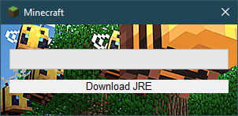
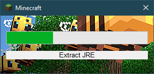
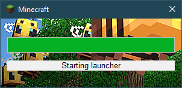

# Gravit Starter

Данная программа предназначеня для запуска GravitLauncher и установки JRE в случае ее отсутствия.
На данный момент (в теории) может запускаться на любой чистой версии Windows начиная с 7. 
Размер собраного загрузчика без учета картинки и иконки 1.3 мегабайта.

## Установка

1. Установить Rust [(Это можно сделать вот здесь)](https://www.rust-lang.org/tools/install)
2. Настроить конфигурацию (config.json)
3. Скопировать в папку с проектом задний экран загрузчика (background.bmp) и иконку (favicon.ico)
4. Установить MSVC Build Tools
5. Установить целевую платформу -  _rustup target add i686-pc-windows-msvc_ (Это Windows x32 для универсальности)
6. Собрать (cargo build --release --target i686-pc-windows-msvc)

## Реализовано  

- [x] Скачивание JRE
- [x] Запуск лаунчера
- [x] Проверка установленной JRE в системе (и проверка на JavaFX)
- [ ] Проверка целостности JRE
- [ ] Локализация
- [ ] Поддержка GTK
- [ ] Поддержка PNG для бэкграунда

## Поддержка

Вы можете поддержать эту разработку своими Issues и Pull Request. 
Так я смогу учесть ваши пожелания и добавить необходимый функционал 

## Скриншоты

